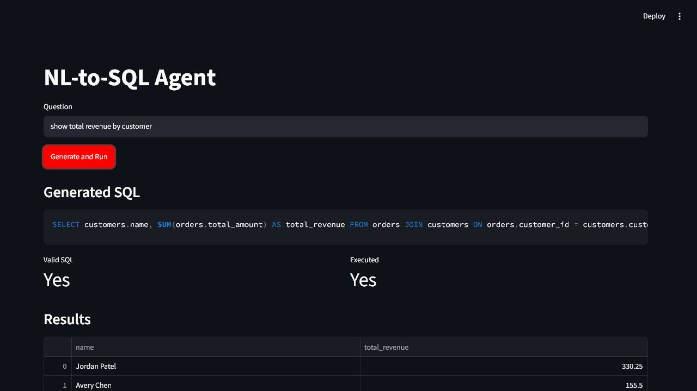

# NL-to-SQL Agent

An AI engineering portfolio project for translating natural-language business questions into validated SQL.

## Portfolio Signal

This project demonstrates:

- schema-aware query generation
- SQL validation before execution
- provider interface for LLM-backed generation
- conservative SQL repair loop
- an API surface suitable for product integration
- testable AI application architecture
- a path from deterministic baseline to LLM-backed agent

## Architecture

```text
Question -> Schema Context -> SQL Generator -> SQL Validator -> Query Result
```

See [docs/architecture.md](docs/architecture.md) for the component diagram.

## Current Status

Implemented:

- deterministic SQL baseline
- DuckDB sample execution
- evaluation harness
- provider interface
- repair loop
- FastAPI API
- Streamlit demo
- Dockerfile and CI workflow

## Quickstart

```powershell
uv sync
uv run pytest
uv run nl-to-sql "show total revenue by customer" --execute
uv run nl-to-sql eval
uv run nl-to-sql repair "SELECT customer_name, SUM(amount) FROM orders JOIN customers USING (customer_id) GROUP BY customer_name"
uv run uvicorn nl_to_sql_agent.api:app --reload
uv run streamlit run app/streamlit_app.py
```

## Docker

```powershell
docker build -t nl-to-sql-agent .
docker run --rm -p 8000:8000 nl-to-sql-agent
```

## Example

```text
Question: show total revenue by customer
SQL:
SELECT customers.name, SUM(orders.total_amount) AS total_revenue
FROM orders
JOIN customers ON orders.customer_id = customers.customer_id
GROUP BY customers.name
ORDER BY total_revenue DESC
```

The `/query` API also executes valid SQL against the seeded DuckDB sample database and returns columns, rows, and row count.

## Evaluation

Run the evaluation suite:

```powershell
uv run nl-to-sql eval
```

Current metrics measure generation success, SQL validity, execution success, and result accuracy against `data/eval/questions.jsonl`.

## Generation Providers

The default generator is deterministic for reproducible tests. The provider interface in `src/nl_to_sql_agent/providers.py` lets the project add hosted LLMs later without changing validation, execution, or evaluation contracts.

## Demo

Run the Streamlit demo:

```powershell
uv run streamlit run app/streamlit_app.py
```

The demo shows the natural-language question, generated SQL, repair status, execution status, and result table.


