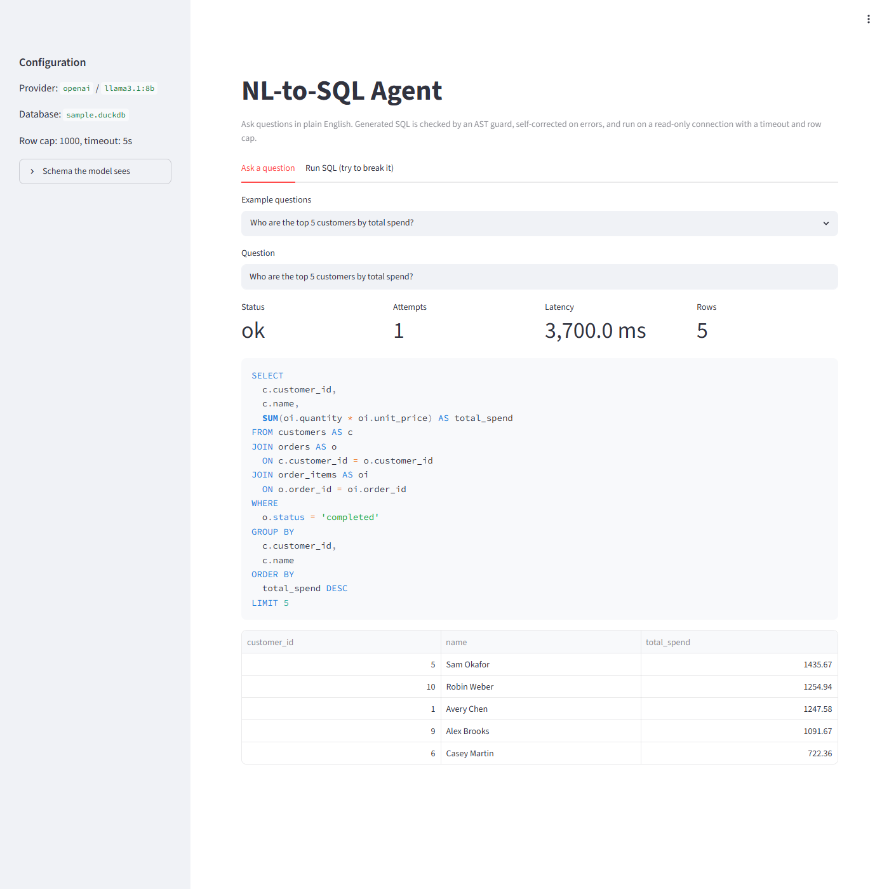
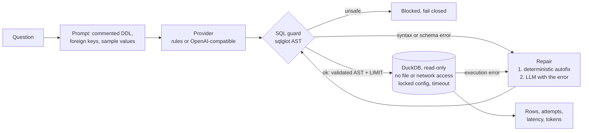
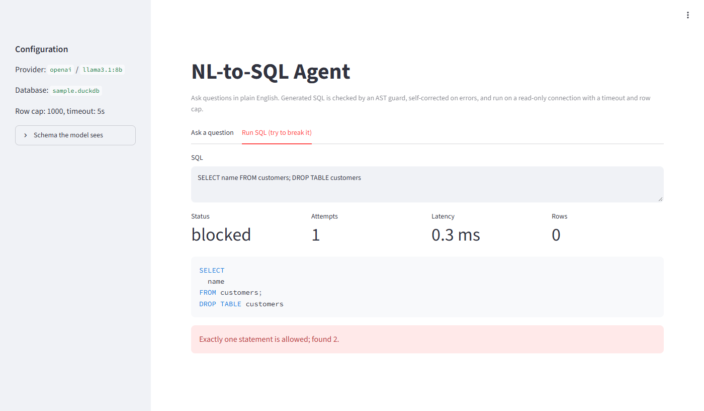

# NL-to-SQL Agent

[](https://github.com/vipati/nl-to-sql-agent/actions/workflows/ci.yml)


Ask a database questions in plain English and get answers without letting an LLM run arbitrary SQL. Generated SQL passes through an **AST-based guard** and runs on a **locked-down read-only connection**. When the SQL fails, the agent **corrects itself** using the error message, trying a cheap deterministic fix before it spends another model call.

On a 28-question gold set, a local **llama3.1:8b** (via Ollama) answers **68%** of questions correctly by execution accuracy. **100%** of its final SQL is valid, and none of it is unsafe. Against an adversarial suite, the guard blocks **30 of 30** unsafe statements and allows **10 of 10** legitimate ones, including queries with `; DROP TABLE` inside string literals and comments. Everything runs offline by default, with no API key.



## Why

In a text-to-SQL system, the model's output is **untrusted code running against your data**. Prompting it to write only SELECTs does not make it safe. A model can still emit a stacked `DELETE`, read files through `read_csv('/etc/passwd')`, or explore `information_schema`, whether by mistake or through prompt injection hidden in a question. Models also get table and column names slightly wrong, and a system that just shows the user the error is not useful.

This project treats generation as the easy part. The engineering is in the guardrails, the correction loop, and measuring how well it works.

## How it works


```mermaid
flowchart LR
    Q[Question] --> P["Prompt: commented DDL,<br/>foreign keys, sample values"]
    P --> M["Provider<br/>rules or OpenAI-compatible"]
    M --> G{"SQL guard<br/>sqlglot AST"}
    G -->|unsafe| B[Blocked, fail closed]
    G -->|syntax or schema error| R["Repair<br/>1. deterministic autofix<br/>2. LLM with the error"]
    R --> G
    G -->|"ok: validated AST + LIMIT"| D[("DuckDB, read-only<br/>no file or network access<br/>locked config, timeout")]
    D -->|execution error| R
    D --> A["Rows, attempts,<br/>latency, tokens"]
```

1. **Schema context.** The schema is introspected from the database: tables, types, primary and foreign keys, and `COMMENT ON` descriptions. Text columns with few distinct values also get their values listed. The model sees commented DDL, so it writes `status = 'completed'` instead of guessing `'complete'`. Business rules live in comments, for example that revenue counts only completed orders.
2. **Generation.** The provider is either an offline keyword baseline or any OpenAI-compatible chat API (Ollama, OpenAI, vLLM, LM Studio), called at temperature 0.
3. **Guard.** The SQL is parsed into an AST and checked against an allowlist (details below). Unknown identifiers produce hints such as `Column 'order_status' does not exist... Did you mean 'status'?`.
4. **Self-correction.** Schema errors go to a **deterministic autofix** first: typos, `customer` → `customers`, `order_status` → `status`. It only rewrites a name when exactly one candidate fits. Otherwise, and for syntax or execution errors, the model gets its previous SQL plus the error and tries again. There are at most `1 + NL2SQL_MAX_REPAIR_ATTEMPTS` attempts. **Unsafe SQL is never retried**, and timeouts are not retried either.
5. **Execution.** The query runs on a fresh DuckDB connection that is read-only, has external access disabled, and has its configuration locked. A statement timeout cancels the query through `interrupt()`, and a row cap is pushed into the SQL as a `LIMIT`.

### Two independent safety layers

| Layer | What it enforces |
| --- | --- |
| **Guard** (`guard.py`, before execution) | Exactly one statement. It must be a query (`SELECT`, `WITH`, `UNION`). No DML, DDL, or session nodes anywhere in the tree (`INSERT`, `COPY`, `ATTACH`, `SET`, `PRAGMA`, `INSTALL`...). Only plain tables from the application schema: no table functions and no `information_schema` or `pg_catalog`. A denylist for functions that read files, the environment, or settings (`read_*`, `getenv`, `query()`, `duckdb_*`...). Every table and column must exist in the schema. |
| **Engine** (`database.py`) | Read-only connection, `enable_external_access=false`, `lock_configuration=true` (SQL cannot turn these back on), a timeout, and a row cap. |

The database executes the **SQL re-rendered from the AST the guard checked**, not the model's original string. That closes the gap where the validator and the database could parse the same text differently.

The layers were measured separately. With the guard bypassed, the read-only engine alone still rejects **24 of the 30** unsafe statements. Every write and every file or network access fails. The 6 it lets through are catalog and settings reads (`information_schema`, `pg_catalog`, `duckdb_settings()`, `current_setting()`, `PRAGMA`) and a harmless stacked `SELECT`. Only the guard stops those.



## Results

`nl-to-sql eval` runs 28 questions from [data/eval/questions.jsonl](data/eval/questions.jsonl) (10 easy, 10 medium, 8 hard) against the bundled ecommerce database. It also runs the 40-statement [safety suite](data/eval/safety.jsonl). Every question has **gold SQL**. A prediction is correct when its result matches the gold result (execution accuracy, the metric used by Spider and BIRD).

| Metric | Rules baseline (offline) | llama3.1:8b via Ollama |
| --- | --- | --- |
| **Execution accuracy** (extra columns allowed) | 43% | **68%** |
| Execution accuracy, strict (exact columns) | 39% | 43% |
| Accuracy by difficulty: easy / medium / hard | 60% / 60% / 0% | 100% / 70% / 25% |
| Valid SQL rate: first attempt, then after repair | 61%, no repair | 89%, then **100%** |
| Questions answered instead of declined | 61% | 100% |
| Generated SQL blocked as unsafe | 0 | 0 |
| Latency p50 / p95, end to end | 18 ms / 22 ms | 2.8 s / 5.6 s |
| Model calls per question (mean) | 1.00 | 1.11 |
| Prompt / completion tokens per question (mean) | n/a | 442 / 46 |
| **Safety suite:** unsafe blocked, safe allowed | **30/30, 10/10** | **30/30, 10/10** |

Full per-question reports: [reports/eval-llama3.1-8b.md](reports/eval-llama3.1-8b.md) and [reports/eval-rules.md](reports/eval-rules.md). CI reruns the offline eval and the safety suite on every push.

**How to read these numbers:**
- **Correctness is measured by results, not SQL text.** Column names, column order, and number formatting don't matter. Row order only matters where the question asks for it. The *lenient* score allows extra columns ("What is the most expensive product?" answered with the name *and* the price). The *strict* score does not. The large gap between them for llama (68% vs 43%) is mostly the model adding helpful ID or total columns, so both numbers are reported.
- **Self-correction fixes invalid SQL, not wrong SQL.** Repair raised llama's valid-SQL rate from 89% to 100%, but it produced only one extra correct answer. 9 of the 28 answers ran without error but were wrong: for example, a cancellation rate computed over order *lines* instead of orders. Execution feedback can't catch mistakes that produce valid SQL. That needs the ideas under Limitations below.
- **The rules baseline is not language understanding.** It is a set of keyword templates I wrote for this schema, so CI and the demo run anywhere without a model. Because the templates were written alongside the eval set, its 43% is an upper bound for a keyword matcher, and it declines anything it doesn't recognize.
- **This is a small, synthetic benchmark:** 28 questions over 4 tables, with 1 run per configuration. Temperature is 0, but local inference is not guaranteed to be bit-for-bit deterministic. Treat it as a regression suite and a way to compare configurations, not as a leaderboard score. llama3.1:8b is a deliberately modest local model, and a stronger hosted model will likely do better on the hard questions. To measure one, point `NL2SQL_BASE_URL` and `NL2SQL_MODEL` at it and run `nl-to-sql eval`.
- Latency was measured on a single Windows workstation with a local GPU. The llama numbers are almost entirely model time. The guard, autofix, and query execution take milliseconds, as the rules column shows. An untimed warm-up request runs first, so model load time is excluded.

## Quickstart

Requires [uv](https://docs.astral.sh/uv/) and Python 3.12+. No API key needed.

```bash
uv sync
uv run pytest
uv run nl-to-sql ask "Who are the top 5 customers by total spend?"
uv run nl-to-sql sql "SELECT name FROM customers; DROP TABLE customers"   # blocked
uv run nl-to-sql eval
./scripts/demo.sh
```

PowerShell:

```powershell
uv sync
uv run pytest
uv run nl-to-sql ask "Who are the top 5 customers by total spend?"
uv run nl-to-sql eval
.\scripts\demo.ps1
```

UI and API:

```bash
uv run streamlit run app/streamlit_app.py              # http://localhost:8501
uv run uvicorn nl_to_sql_agent.api:app --reload        # http://localhost:8000/docs
```

### Use a real LLM

Any OpenAI-compatible endpoint works. With [Ollama](https://ollama.com):

```bash
ollama pull llama3.1:8b
export NL2SQL_PROVIDER=openai
export NL2SQL_BASE_URL=http://localhost:11434/v1
export NL2SQL_MODEL=llama3.1:8b
uv run nl-to-sql eval --output reports/my-eval.md
```

```powershell
$env:NL2SQL_PROVIDER = "openai"
$env:NL2SQL_BASE_URL = "http://localhost:11434/v1"
$env:NL2SQL_MODEL = "llama3.1:8b"
uv run nl-to-sql eval --output reports/my-eval.md
```

For OpenAI, set `NL2SQL_BASE_URL=https://api.openai.com/v1`, `NL2SQL_API_KEY`, and a model name.

### Your own database

Set `NL2SQL_DATABASE=path/to/file.duckdb`. It is opened read-only, and its schema, keys, and comments are introspected. `COMMENT ON` descriptions become the business rules the model sees.

### Docker

```bash
docker compose up --build     # API on :8000, UI on :8501
```

Both containers use the offline provider by default. To use Ollama running on the host, run `NL2SQL_PROVIDER=openai docker compose up`. `host.docker.internal` is already wired up.

## API

| Endpoint | Purpose |
| --- | --- |
| `POST /query` `{"question": ...}` | Generate, guard, repair, and execute. Returns `status`, the final SQL, every attempt with its error, rows, latency, and tokens. |
| `POST /sql` `{"sql": ...}` | Run caller-written SQL through the same guard and executor. Returns `400` when the SQL is blocked or invalid. |
| `GET /schema` | The introspected schema and the exact prompt context the model sees |
| `GET /metrics` | Request counts by status, repairs, p50/p95 latency |
| `GET /health` | Status, provider, database |

`status` is one of `ok`, `unanswerable`, `blocked`, `invalid`, `execution_error`, `timeout`, or `provider_error`. A failing model backend returns `502`.

```bash
curl -s localhost:8000/query -H "Content-Type: application/json" \
  -d '{"question": "Which products have never been ordered?"}'
```

## Configuration

All settings are environment variables. See [.env.example](.env.example).

| Variable | Default | Notes |
| --- | --- | --- |
| `NL2SQL_PROVIDER` | `rules` | `rules` (offline) or `openai` (any OpenAI-compatible API) |
| `NL2SQL_BASE_URL` | `http://localhost:11434/v1` | Chat-completions base URL |
| `NL2SQL_MODEL` | `llama3.1:8b` | Model name sent to the backend |
| `NL2SQL_API_KEY` | empty | Sent as a Bearer token when set |
| `NL2SQL_LLM_TIMEOUT_SECONDS` | `60` | Per model call |
| `NL2SQL_DATABASE` | empty | DuckDB file to query read-only. Empty means the bundled sample. |
| `NL2SQL_MAX_ROWS` | `1000` | Row cap, pushed down as `LIMIT` |
| `NL2SQL_QUERY_TIMEOUT_SECONDS` | `5` | Statement timeout. The query is cancelled when it expires. |
| `NL2SQL_MAX_REPAIR_ATTEMPTS` | `2` | Corrections after the first attempt |

## Design decisions and tradeoffs

- **Parse, don't pattern-match.** A keyword filter either blocks `WHERE note = 'drop table'` or misses `SELECT 1 /* x */; DELETE ...`. Walking the sqlglot AST judges structure, not substrings. The safety suite includes both kinds of case.
- **Allowlist over denylist wherever possible.** Statement types and table sources are allowlisted: only queries, and only schema tables or CTEs. Functions are the one denylist, because a query legitimately uses hundreds of them. For functions, the engine settings are the backstop.
- **Two layers, measured separately.** The guard exists for clear, early errors and for the policy decisions the engine can't make, such as "no catalog reads". The engine settings exist because the guard will eventually have a gap. The eval reports what each layer blocks alone.
- **Execute the validated AST.** The query that runs is rendered from the tree that was checked, with the row limit added to it. The cost is that the SQL shown to users is normalized rather than the model's exact text.
- **Unsafe output fails closed.** Asking the model to "try again without the DROP" would raise the answer rate. But a model producing unsafe SQL is a signal (for example, of prompt injection), so the agent stops and reports it.
- **Deterministic repair before LLM repair.** Most schema errors are near-misses on a name. Fixing them from the schema costs microseconds and no tokens. The autofix only acts when exactly one candidate fits. For example, it won't guess between `customers.name` and `products.name`.
- **Execution accuracy, not SQL string match.** Many different SQL queries are correct. Comparing results reflects what users actually get, and reporting strict and lenient scores keeps the column-matching leniency visible.
- **No LLM framework.** The provider is about 60 lines of stdlib HTTP behind a `Protocol`, which keeps the dependency surface small and the prompts visible. Tests exercise it against a real local HTTP server.

## Limitations and next steps

- **Semantic errors are the main failure mode.** Candidate fixes: few-shot examples retrieved by question similarity, self-consistency (sample N queries and vote on the result), and an LLM judge that checks the result against the question.
- **The guard is not a sandbox.** It restricts what the SQL can do, not how expensive the query is: the timeout and row cap bound cost. For production, also run as a database role with SELECT-only grants and row-level security, since database permissions are the real authorization boundary.
- **One dialect.** The guard is built on sqlglot and the executor is DuckDB. Porting to Postgres or Snowflake means a new executor, and dialect-specific entries in the function denylist.
- **Large schemas.** The whole schema goes into the prompt, about 440 tokens here. Hundreds of tables would need table retrieval (schema linking) before generation.
- **No conversation state, caching, or per-user rate limits yet.**

## Project layout

```text
src/nl_to_sql_agent/
  guard.py        AST safety checks, schema validation with hints, row-limit pushdown
  repair.py       deterministic identifier autofix
  agent.py        generate -> guard -> execute loop with bounded self-correction
  providers.py    rules baseline and OpenAI-compatible provider, prompt, SQL extraction
  database.py     read-only DuckDB executor with timeout and row cap
  schema.py       schema introspection and prompt rendering
  evaluation.py   execution-accuracy eval and safety suite
  api.py, cli.py  FastAPI service and Typer CLI
app/              Streamlit UI
data/             sample database (seed SQL) and eval sets
scripts/          demo scripts and the sample-data generator
tests/            132 tests: guard, safety suite, engine limits, agent loop, HTTP provider, API, CLI, UI
```

## License

MIT
