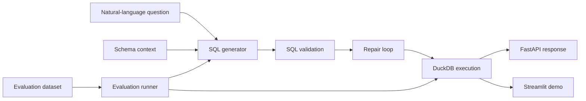

# Architecture

## Components

- `generator.py`: deterministic baseline and provider-backed generation entry point.
- `providers.py`: prompt and provider interfaces for future hosted LLM integrations.
- `validator.py`: SQL syntax validation with SQLGlot.
- `repair.py`: conservative repair loop for known schema mistakes.
- `database.py`: in-memory DuckDB execution against seeded ecommerce data.
- `evaluation.py`: generation, validation, execution, and result-accuracy metrics.
- `api.py`: FastAPI surface for product integration.
- `app/streamlit_app.py`: recruiter-friendly interactive demo.

